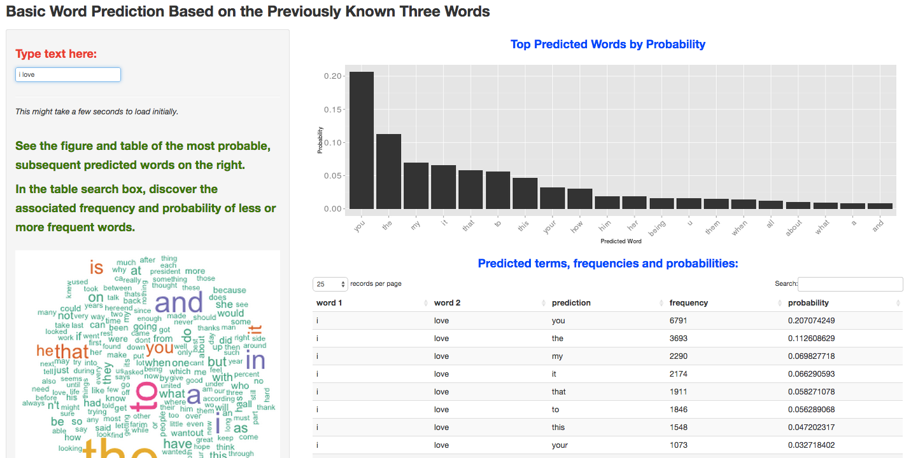

NLP_presentation

Word Prediction App Based on Previously Known Words
========================================================
author: Nicole Goebel 
date: December 2014
JHU/Swiftkey Capstone Project for the Coursera Data Science Specialization 

Methods for cleaning the raw corpus
========================================================

1. Derived files from blogs, tweets, and news ([HC Corpora](www.corpora.heliohost.org)).
2. Broke files down into 6000-line .txt files.
3. Cleaned each file by removing numbers, punctuation, symbols; replacements (&->and, u->you); lower case
4. Replaced words with a frequency of 3 or less with the artificial word 'unk' to estimate the unknown word frequency.
5. Created 4-word ngrams from each cleaned .txt files, converted to data.tables of frequencies.
6. Combined quadgram frequency data.tables.
7. Added quadgrams derived from [Corpus of Contemporary English (COCA)](http://www.ngrams.info) by Mark Davies (2011).
8. Derived tri-, bi- and uni-grams from quadgrams.

Data used to train predictive model
======================================================
left:55%
- 1-word ngrams consisted of ~64,000 unique words.
- A maximum frequency of ~5.4 million occurred for "`the`".
- ~819,000 bigrams
- ~2.7 million trigrams
- ~5.6 million quadgrams 
- COCA contributed ~1000 unigrams, ~18,000 bigrams, ~300,000trigrams and ~1 million quadgrams.

***

Predictive backoff algorithm
========================================================
Applied a "backoff"" modelling approach to predict a subsequent word, by using progressively shorter histories. Quadgram e.g.: 

1. search for the most frequent quadgram ("I love to '?'"), if no word exists,  
2. search for the most frequent trigram ("love to '?'"), if no word exists, 
3. search for the most frequent bigram ("to '?'"), and if no word exists, 
4. utilize the most frequent unigram. 

> Despite other complex approaches (linear interpolation, stupid backoff, sentiment analysis), this basic algorithm applied to a model trained on a relatively small number of words across disparate corpora classes, compared well with that used for iPhone text predictions.

Example output of my app (e.g. "I love ...")
========================================================
- Application can be found at [shiny app website](https://nicolegoebel.shinyapps.io/shiny_NLP_COCA_combo/)
- Type word sequence in upper left box. See top predicted words in right barplot and table.
- Search for words and their frequencies and probabilities in table search box.
- Same top words predicted by iPhone app in this example and other randomly trialed terms (e.g., New York Times text!).

